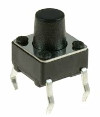

# EventButton Class

The [`EventButton`](EventButton.md) class is for momentary inputs. The momentary switch (button) must be wired between the pin and GND.

`EventButton` is probably the easiest way to implement a button - a single function and three lines of code gives you information on all types of user inputs as detailed in the [Event Types](#event-types) below.

It is effectively an event wrapper for Thomas Fredericks' [Bounce2 library](https://github.com/thomasfredericks/Bounce2) - huge thanks to the Thomas - I am standing on the shoulders of giants.




## Basic Usage

```cpp
#include <EventButton.h>
// Create a EventButton input.
EventButton myButton(19);
// Create a callback handler function
void onButtonEvent(InputEventType et, EventButton& eb) {
    Serial.print("Button event fired.");
}
void setup() {
  Serial.begin(9600);
  myButton.begin();
  delay(500);
  //Link the event(s) to your function
  myButton.setCallback(onButtonEvent);
}
void loop() {
    // Call 'update' for every EventAnalog
  myButton.update();
}
```
See [example Button.ino](../examples/Button/Button.ino) for a slightly more detailed sketch.

## API Docs

See EventButton's [Doxygen generated API documentation](https://stutchbury.github.io/InputEvents/api/classEventButton.html) for more information.


