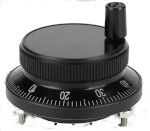

# EventEncoder Class

The [`EventEncoder`](EventEncoder.md) class is for quadrature encoder inputs providing the position & encoder increment, event rate limiting without losing steps (eg for easy acceleration or to reduce events sent over Serial). 

It is effectively an event wrapper around a low level encoder library. By default, Paul Stoffregen's [Encoder library](https://www.pjrc.com/teensy/td_libs_Encoder.html) is used but adapters can easily be created for others (and more will be added).

Huge thanks to Paul - again, I am standing on the shoulders of giants.




## Basic Usage

> Note: Unlike other inputs, `EventEncoder` and `EventEncoderButton` are not directly linked to the pins but through an `EncoderAdapter`. This allows the classes to use different underlying encoder libraries. 
 
You must explicitly `#include` both the chosen encoder library and its adapter and then pass the adapter to the `EventEncoder`:

```cpp
//First include your chosen encoder library
#include <Encoder.h> //PJRC's Encoder library
//Then include the adapter for the encoder library
#include <PjrcEncoderAdapter.h> //Adapter for PJRC's Encoder
//Then include EventEncoder
#include <EventEncoder.h>
//Create an adapter for PJRC's Encoder.
PjrcEncoderAdapter encoderAdapter(2,3); //Should be interrupt pins
//Create an EventEncoder, passing a reference to the adapter
EventEncoder myEncoder(&encoderAdapter);
// Create a callback handler function
void onEncoderEvent(InputEventType et, EventEncoder& ee) {
    Serial.print("Encoder event fired. Position is: ");
    Serial.println(ee.position());
}
void setup() {
    Serial.begin(9600);
    myEncoder.begin();
    // Link the encoder's callback to function defined above
    myEncoder.setCallback(onEncoderEvent);
}
void loop() {
    // Call 'update' for every EventEncoder
    myEncoder.update();
}
```

See [example Encoder.ino](../examples/Encoder/Encoder.ino) for a slightly more detailed sketch.

Please see [Encoder Adapter Notes](docs/README.md#encoder-adapter-notes) on using encoder libraries and [additional notes](docs/README.md#notes-on-using-paul-stoffregens-encoder-library) on using PJRC's Encoder library with InputEvents.

## API Docs

See EventEncoder's [Doxygen generated API documentation](https://stutchbury.github.io/InputEvents/api/classEventEncoder.html) for more information.

