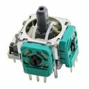

# EventJoystick Class

The [`EventJoystick`](EventJoystick.md) class contains two [`EventAnalog`](EventAnalog.md) inputs configured as a joystick.



## Basic Usage

```cpp
#include <EventJoystick.h>
// Create an EventJoystick input
EventJoystick myJoystick(A0, A1);
// Create a callback handler function
void onJoystickEvent(InputEventType et, EventJoystick& ej) {
    Serial.print("Joystick event fired. X position is: ");
    Serial.print(ej.x.position());
    Serial.print(" Y position is: ");
    Serial.println(ej.y.position());
}
void setup() {
    Serial.begin(9600);
    // Link the joystick's callback to function defined above
    myJoystick.setCallback(onJoystickEvent);
    myJoystick.setStartValues();
}
void loop() {
    // Call 'update' for every EventJoystick
    myJoystick.update();
}
```

See [example Joystick.ino](../examples/Joystick/Joystick.ino) for a slightly more detailed sketch.


## Event Types

In addition to the [common events](Common.md#common-events) (Enabled, Disabled and Idle) the following event types are fired by EventJoystick:


#### `InputEventType::CHANGED_X` 
Will be fired on each change of increment on the X axis.

#### `InputEventType::CHANGED_Y` 
Will be fired on each change of increment on the Y axis.


## Constructor

Construct an EventJoystick
```cpp
EventJoystick(byte analogPinX, byte analogPinY);
```

## Class Methods

In addition to the [common methods](Common.md#common-methods) the following are available for EventAnalog:

#### `void update()`

Must be called within `loop()`. See [common methods](Common.md#void-update) for details.


### Setup

Setup methods are typically called from within `setup()` but can be updated at runtime.

#### `void setCallback(CallbackFunction func)`

See [common methods](Common.md#void-setcallbackcallbackfunction-func) for details.


#### `void setStartValues()`
Set the underlying analog values for x & y that equates to the zero position - read from current position.

#### `void setNumIncrements(uint8_t numIncr=10)`
Split the analog range of both axis into this number of slices. A changed callback will be fire each time the increment changes. You can also set increments on individial axis after this has been called.

#### `void setNumNegativeIncrements(uint8_t numIncr=10)`
Normally increments are set with setNumIncrements but you can also set the negative and positive sides individually.

#### `void setNumPositiveIncrements(uint8_t numIncr=10)`
Normally increments are set with setNumIncrements but you can also set the negative and positive sides individually.

#### `void setCentreBoundary(uint16_t width=200)`
This sets a 'dead zone' in the centre of the joystick - very useful if the joystick has a button which is often a challenge to press without triggering a changed event.


#### `void setOuterBoundary(uint16_t width=100)`
Set the outer boundary of the joystick. This is useful to 'trim' the corners of the joystick so you get the maximum position in a circumference rather than in the corners.


All the [`EventAnalog` setup](EventAnalog.md#setup) methods are available for each axis via `myJoystick.x` and `myJoystick.y`.

### State


#### `bool hasChanged()`
Returns `true` if either X or Y position has changed since previous `update()`.

All the [`EventAnalog` state](EventAnalog.md#state) methods are available for each axis via `myJoystick.x` and `myJoystick.y`.
