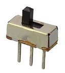

# EventSwitch Class

The [`EventSwitch`](EventSwitch.md) class is for standard on/off inputs. Like the [`EventButton`](EventButton.md) the switch must be wired between the pin and GND. When the switch is closed (LOW) its state will be 'ON' and when open (HIGH) it will be 'OFF'.

A quick explainer: The switch pin is configured with the microcontroller's internal [`INPUT_PULLUP` resistor](https://en.wikipedia.org/wiki/Pull-up_resistor). In this configuration, without anything attached, the pin will read as HIGH because it has been 'pulled up' to the voltage of the board (either 3.3V or 5V). When you attach a switch (or button) that is wired from the pin to GND, if the switch is closed (or the button pressed), the weak pullup resistor is overcome by the closed switch 'pulling' the pin to GND (0V) or LOW.




## Basic Usage


```cpp
#include <EventSwitch.h>
// Create an EventSwitch input
EventSwitch mySwitch(18);
// Create a callback handler function
void onSwitchEvent(InputEventType et, EventSwitch& es) {
    Serial.print("Switch event fired: ");
    Serial.println(es.isOn() ? "ON" : "OFF");
}
void setup() {
    Serial.begin(9600);
    // Link the switch's callback to function defined above
    mySwitch.setCallback(onSwitchEvent);
}
void loop() {
    // Call 'update' for every EventSwitch
    mySwitch.update();
}
```

See [example Switch.ino](../examples/Switch/Switch.ino) for a slightly more detailed sketch.


## Event Types

In addition to the [common events](Common.md#common-events) (Enabled, Disabled and Idle) the following event types are fired by EventSwitch:


#### `InputEventType::ON` 
Will be fired after switch is turned on.

#### `InputEventType::OFF` 
Will be fired after switch is turned off.


## Constructor

Construct an EventSwitch
```cpp
EventSwitch(byte switchPin);
```

## Class Methods

In addition to the [common methods](Common.md#common-methods) the following are available for EventAnalog:

#### `void update()`

Must be called within `loop()`. See [common methods](Common.md#void-update) for details.


### Setup

Setup methods are typically called from within `setup()` but can be updated at runtime.

#### `void setCallback(CallbackFunction func)`

See [common methods](Common.md#void-setcallbackcallbackfunction-func) for details.


#### `void reverseOnOff(bool rev=true)`
If your wiring is reversed, you can switch it with this method. The `ON` event is fired in place of the `OFF` event and vice versa. Default is `true` so pass `false` to return to 'normal' behaviour. 

#### `bool isOnOffReversed()`
Returns true if on and off are reversed.


#### `void setDebounceInterval(unsigned int intervalMs)`
Default is set in the Bounce2 library (currently 10ms)


### State

#### `bool isOn()`
Returns true if the switch is on.


#### `bool isOff()`
Returns true if the switch is off.


#### `unsigned long currentDuration()`
Directly get the duration of the switch current state from Bounce2

#### `unsigned long previousDuration()`
Directly get the previous duration of the switch previous state from Bounce2

