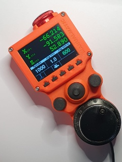

# InputEvents Library Documentation


## Classes and Events
#### [Common Events and Class Methods](Common.md)
#### [EventAnalog](EventAnalog.md)
#### [EventButton](EventButton.md)
#### [EventEncoder](EventEncoder.md)
#### [EventEncoderButton](EventEncoderButton.md)
#### [EventJoystick](EventJoystick.md)
#### [EventSwitch](EventSwitch.md)

----

## [Event Programming 101](EventProgramming101.md)
If you're new to the concept of event programming, [here is a short primer](EventProgramming101.md). It will make coding your project so much easier!

----

## Encoder Adapter Notes

Since v1.2.0, you can use almost any encoder library via an [EncoderAdapter](https://github.com/Stutchbury/EncoderAdapter). 

Currently an adapter is provided for PJRC's Encoder but more will be added or you can write your own.

See the [PJRC one](https://github.com/Stutchbury/EncoderAdapter/blob/main/src/PjrcEncoderAdapter.cpp) as an example of how simple it is! If you want to share your adapter, I will add it the the EncoderAdapter library.

These changes mean that rather than passing the encoder pins to the `EventEncoder` or `EventEncoderButton` constructors, we pass an EncoderAdapter that has been previously constructed from the pins.

You must include both the appropriate encoder library and its adapter in your sketches.

eg:

```
#include <Encoder.h> //PJRC's lib
#include <PjrcEncoderAdapter.h>
```
and then:
```
PjrcEncoderAdapter encoderAdapter(2,3); //Should be interrupt pins
EventEncoder myEncoder(&encoderAdapter);
```

----

## Notes on using Paul Stoffregen's Encoder Library

> Since v1.2.0, Paul's Encoder Library remains the default but you can now use different encoder libraries with `InputEvents`. See Encoder Adapter Notes above.

Please take care to read the pin requirements in the [official documantation page](https://www.pjrc.com/teensy/td_libs_Encoder.html) (TLDR; use interupt pins). The github repository is [here](https://github.com/paulstoffregen/Encoder).

This library is very good (and very optimised) for the boards it supports, but it doesn't support all microcontrollers.

I have tested with:

- **Teensy** - 4.1, no issues
- **Arduino UNO** - the base line AVR type board, only 2 interrupt pins!
- **ESP8266** - D1 Mini & Adafruit Feather 8266. Lots of compiler deprecation warnings for Encoder but compiles OK. Only one analog pin, so no joystick.
- **ESP32** - D1 Mini32 & other random ones. No issues since v1.0.2.

Encoder supports far more boards than I have available for testing but if your board is not supported, the [`EventEncoder`](EventEncoder.md) and [`EventEncoderButton`](EventEncoderButton.md) classes will be excluded if you do not have PJRC's Encoder library installed in your project.

----


## Testing

I'm investigating how to write a unit test suite but mocking input pins (particularly for the encoder) is currently a little beyond my paygrade. Pull requests welcome.

In the meantime, these are my physical test rigs:

A custom 'hat' For Arduino UNO, ESP8266 and ESP32:


and a [Manaualmatic Pendant](https://github.com/Stutchbury/Manualmatic-Pendant) for the Teensy 4.1:


