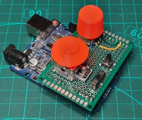

# InputEvents Library Documentation

## Classes and Events
#### [Common Events and Class Methods](Common.md)
#### [EventAnalog](EventAnalog.md)
#### [EventButton](EventButton.md)
#### [EventEncoder](EventEncoder.md)
#### [EventEncoderButton](EventEncoderButton.md)
#### [EventJoystick](EventJoystick.md)
#### [EventSwitch](EventSwitch.md)

----

## [Event Programming 101](EventProgramming101.md)
If you're new to the concept of event programming, [here is a short primer](EventProgramming101.md). It will make coding your project so much easier!

----
## Notes on using Paul Stoffregen's Encoder Library

Please take care to read the pin requirements in the [official documantation page](https://www.pjrc.com/teensy/td_libs_Encoder.html) (TLDR; use interupt pins). The github repository is [here](https://github.com/paulstoffregen/Encoder).

This library is very good (and very optimised) for the boards it supports, but it doesn't support all microcontrollers.

I have tested with:

- **Teensy** - 4.1, no issues
- **Arduino UNO** - the base line AVR type board, only 2 interrupt pins!
- **ESP8266** - D1 Mini & Adafruit Feather 8266. Lots of compiler deprecation warnings for Encoder but compiles OK. Only one analog pin, so no joystick.
- **ESP32** - D1 Mini32 & other random ones. No issues since v1.0.2.

Encoder supports far more boards than I have available for testing but if your board is not supported, the [`EventEncoder`](EventEncoder.md) and [`EventEncoderButton`](EventEncoderButton.md) classes will be excluded if you do not have PJRC's Encoder library installed in your project.

In the Arduino IDE you must expicitly `#include <Encoder.h>` before `EventEncoder.h` or `EventEncoderButton.h` in your sketches.

PlatformIO will automatically `#include <Encoder.h>` if the library is installed in your project.

I have taken the decision to not have PJRC's Encoder as a 'hard' dependency so the rest of the InputEvents library can be used even if your board is not supported by Encoder. At some point I will try to investigate using additional/alternative encoder libraries (looking at you RPI2040) but pull requests would be more than welcome.

----

## Testing

I'm investigating how to write a unit test suite but mocking input pins (particularly for the encoder) is currently a little beyond my paygrade. Pull requests welcome.

In the meantime, these are my physical test rigs:

A custom 'hat' For Arduino UNO, ESP8266 and ESP32:

and a [Manaualmatic Pendant](https://github.com/Stutchbury/Manualmatic-Pendant) for the Teensy 4.1:

